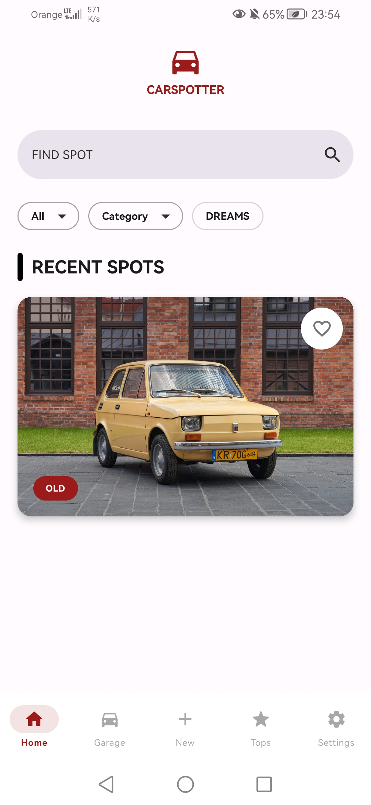
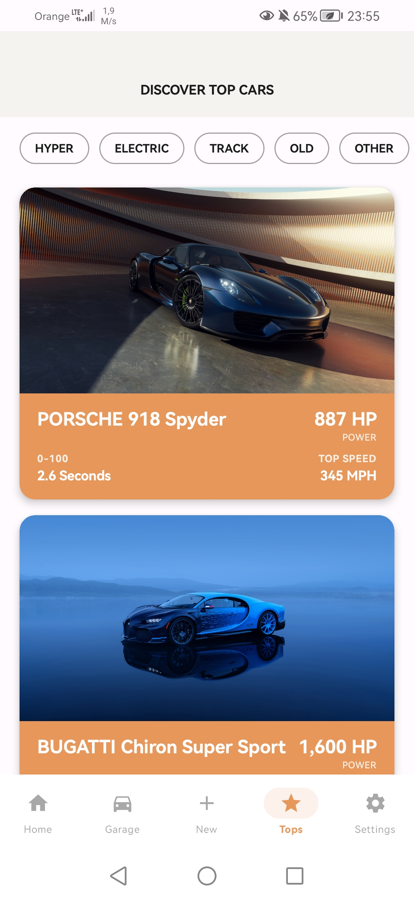
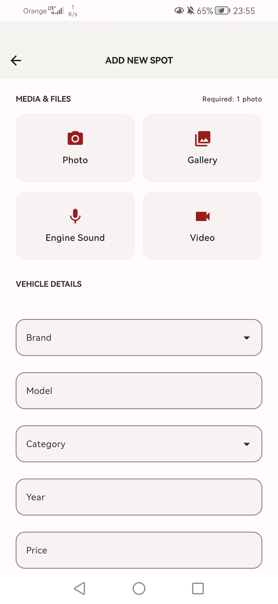

# CarSpotter

An Android app for car enthusiasts to spot, catalogue, and explore interesting vehicles. Log cars you encounter on the street, discover top-tier supercars, and build your personal garage collection.

## Screenshots

| Home | Tops | Add Spot |
|:---:|:---:|:---:|
|  |  |  |

## Features

**Home**
- Feed of recent spots with large card thumbnails
- Full-text search bar ("Find Spot")
- Filter chips: All · Category · Dreams
- Like/favourite a spot directly from the feed

**Add Spot**
- Capture a photo with the camera or pick from gallery
- Record engine sound (audio)
- Attach a video clip
- Fill in vehicle details: Brand (dropdown), Model, Category (dropdown), Year, Price

**Tops**
- Curated list of iconic cars with performance stats (HP, 0–100, top speed)
- Category filters: Hyper · Electric · Track · Old · Other

**Garage**
- Personal collection of all spots added by the logged-in user

**Settings**
- App preferences and account management

## Tech Stack

| Layer | Technology |
|---|---|
| Language | Kotlin |
| UI | Jetpack Compose |
| Dependency Injection | Hilt |
| Local Database | Room (KSP) |
| Backend / Auth | Appwrite |
| Navigation | Navigation Compose |
| Testing | JUnit 4, Mockito, Espresso |

